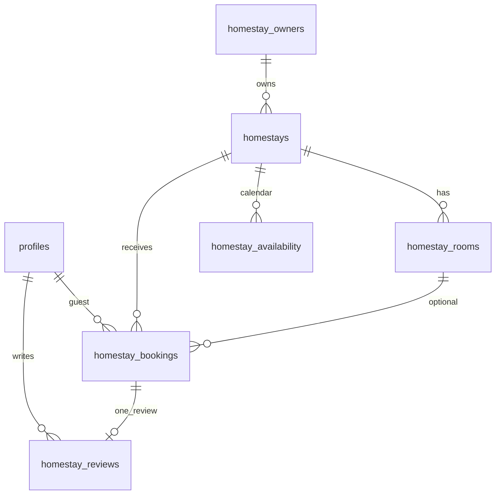

# Homestay Module — Architecture (The Royal Passage)

This document extends the existing **Experience Booking** platform into a **Travel & Hospitality Marketplace** while reusing auth, theme, Connect RPC backend, and Supabase.

> **Stack note:** Production app uses **TanStack Start + Vite + React** (not Next.js). Patterns below map 1:1 to current repo layout.

---

## 1. Product modules

| Module | Status | Guest | Provider | Admin |
|--------|--------|-------|----------|-------|
| **Experiences** | Live | Browse, book slots, review | Host dashboard | Approve, bookings, revenue |
| **Homestays** | Phase 3 live | Browse, book stays, history | Owner dashboard | Approve listings, owners |

**Single account:** One `guest` profile books both experiences and homestays. No separate consumer login.

---

## 2. Roles & RBAC

| Role | Purpose | Dashboard |
|------|---------|-----------|
| `guest` | Book experiences + homestays | `/dashboard/*` |
| `host` | Experience provider | `/host/*` |
| `homestay_owner` | Property provider | `/homestay/*` (planned) |
| `admin` | Full platform | `/admin` |
| `editor` | Homepage CMS | `/` + journal |

### Permission matrix (target)

| Action | guest | host | homestay_owner | admin |
|--------|-------|------|----------------|-------|
| Book experience | ✓ | ✗ | ✗ | ✗ |
| Book homestay | ✓ | ✗ | ✗ | ✗ |
| Manage experiences | ✗ | own | ✗ | all |
| Manage homestays | ✗ | ✗ | own | all |
| Create homestay owner | ✗ | ✗ | ✗ | ✓ |
| Moderate reviews | ✗ | ✗ | ✗ | ✓ |
| Platform settings | ✗ | ✗ | ✗ | ✓ |

Backend enforcement: `backend/app/rpc/auth.py` → extend with `require_homestay_owner()`.

---

## 3. Database (Supabase / PostgreSQL)

**Core file:** `supabase/homestay-module.sql` (run after `schema.sql`)

### New tables

```
homestay_owners ──< homestays ──< homestay_rooms
                      │
                      ├── homestay_availability (calendar / pricing)
                      ├── homestay_bookings
                      └── homestay_reviews
```

### Reused tables

- `profiles` — add `homestay_owner_id`, role `homestay_owner`
- `cities` — homestay location FK
- `notifications`, `audit_logs`, `platform_settings` — shared events
- `payments` / `payouts` — extend with `booking_type` enum (future)

### Indexes

- `homestays(status, city_slug)`, `homestay_bookings(check_in, check_out)`, guest FK indexes

### RLS

- Public `SELECT` on published homestays + published reviews
- Guests read own homestay bookings
- All writes via **service role** (Connect backend), same as experiences

---

## 4. API architecture (Connect RPC)

Production path: `proto/royalpassage/v1/service.proto` → `backend/app/rpc/servicer.py`

### Planned RPC groups

**Public catalog**
- `ListHomestays`, `GetHomestayBySlug`

**Guest**
- `CreateHomestayBooking`, `ListGuestHomestayBookings`, `CancelHomestayBooking`

**Homestay owner**
- CRUD homestays, rooms, availability blocks, seasonal pricing
- `ListOwnerHomestayBookings`, confirm/reject

**Admin**
- CRUD homestay owners (mirror `CreateHost`)
- Approve/reject listings, homestay analytics

Frontend clients: `src/lib/api/homestays.ts`, `homestay-bookings.ts` (mirror experience modules).

---

## 5. Frontend routes (TanStack Router)

### Implemented (Phases 1–3)

| Route | Purpose |
|-------|---------|
| `/` | Home + **MarketplaceModuleNav** (Experiences \| Homestays) |
| `/homestays` | Homestay catalog |
| `/homestays/$slug` | Property detail |
| `/homestays/$slug/book` | Check-in/out booking wizard |
| `/homestay/dashboard` | Owner overview |
| `/homestay/properties` | Owner property list + CRUD |
| `/homestay/bookings` | Owner stay booking management |
| `/admin/homestays` | Admin approval queue |
| `/admin/homestay-owners` | Admin create owners |
| `/dashboard/history` | Unified experience + homestay bookings |
| `/experiences` | Existing catalog + module nav |

### Planned (Phase 4+)

| Route | Purpose |
|-------|---------|
| `/homestay/revenue` | Owner revenue analytics |
| Online payments (Razorpay / Stripe) for homestays |

---

## 6. UI / theme

Reuse existing design system:

- **Page background:** burgundy (`--background`, `.experience-detail-page`)
- **Panels:** `.luxury-checkout-panel`, cream tokens (`--cream-white`, gold trim)
- **Cards:** mirror `ExperienceCard` → `HomestayCard`
- **Nav:** `MarketplaceModuleNav` on home, experiences, homestays

---

## 7. Booking flows

### Experience (existing)

Select date → select slot → guests → COD confirm → host confirms → auto-complete after slot end

### Homestay (planned)

Select check-in / check-out → guests → **cash payment confirmation** → owner confirms → pay cash at check-in → auto-complete after check-out

**Payment:** Cash only at the homestay (COD). No online payment in Phase 4.

**Availability check:** no overlapping confirmed bookings for same room; respect `homestay_availability.is_blocked`.

---

## 8. Payments

Admin-controlled via `platform_settings`:

- COD (current default for experiences)
- Razorpay / Stripe (homestay + optional experience upgrade)
- Advance vs full payment, refund workflow on `homestay_bookings.payment_status`

---

## 9. Notifications

Extend `notifications.type` check constraint:

- `homestay_booking_created`, `homestay_booking_confirmed`, `homestay_booking_cancelled`
- Email/SMS via existing notification service (Phase 2)

---

## 10. Admin dashboard structure

Single admin shell with two panels:

**Experience Management** — existing nav  
**Homestay Management** — owners, homestays, rooms, bookings, reviews  
**Finance** — split revenue reports  
**Users / Settings** — shared

Update `src/components/admin/admin-nav.ts` when backend is ready.

---

## 11. Deployment

| Layer | Current | Homestay addition |
|-------|---------|-------------------|
| Frontend | Vercel | Same — new routes auto-deploy |
| API | Render (Connect) | New RPC methods + services |
| DB | Supabase | Run `homestay-module.sql` |
| Media | Supabase storage | New bucket `homestay-photos` |
| Cache | Optional Redis | Catalog list caching |

---

## 12. Implementation phases

### Phase 1 ✅ (this commit)
- Marketplace nav on homepage
- `/homestays` preview catalog + demo data
- Homestays showcase section on home
- Header/footer links
- SQL schema file

### Phase 2 ✅
- Connect RPC: `ListHomestays`, `GetHomestayBySlug`, `CreateHomestayBooking`, `CreateHomestayOwner`
- Backend services + seed data in `homestay-module.sql`
- Homestay detail `/homestays/$slug` + booking `/homestays/$slug/book`
- Admin `/admin/homestay-owners` create owner form
- `homestay_owner` role + placeholder owner dashboard

### Phase 3
- Owner dashboard, calendar pricing, room management
- Unified guest booking history
- Razorpay/Stripe

### Phase 4 (cash payment)
- Pay-in-cash-at-homestay checkout flow (3-step wizard)
- Guest stay detail `/stays/$bookingId` with cash payment instructions
- Auto-complete stays after check-out (COD marked paid)
- Owner "Mark cash received" workflow

### Phase 5+
- Analytics (Recharts), payouts, support tickets
- Online payments (Razorpay / Stripe) if needed later

---

## 13. Folder structure (target)

```
src/
  components/homestays/     # cards, hero, booking panel
  components/homestay-owner/ # owner dashboard (planned)
  data/homestays.ts         # demo → API types
  lib/api/homestays.ts      # Connect client
  routes/homestays.*        # public routes
  routes/homestay.*         # owner routes (planned)
backend/app/services/
  homestays.py
  homestay_bookings.py
  homestay_owners.py
supabase/homestay-module.sql
```

---

## 14. ER diagram (logical)



---

*Last updated: Phase 1 foundation — UI + schema. Align with `supabase/schema.sql` for experience tables.*
